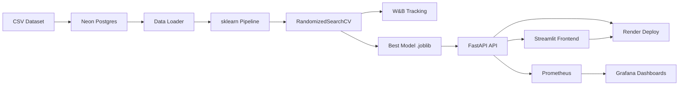

# 🧠 Student Depression Classification Pipeline

> **ML Classification System with MLOps Best Practices** — End-to-end pipeline from data ingestion to deployment, featuring experiment tracking, API serving, monitoring, and CI/CD.


---

## 📋 Table of Contents

- [Overview](#overview)
- [Architecture](#architecture)
- [Dataset](#dataset)
- [Project Structure](#project-structure)
- [Setup & Installation](#setup--installation)
- [Data Layer](#1-data-layer)
- [Model Training](#2-model-training--experimentation)
- [API Server](#3-fastapi-backend)
- [Docker & Monitoring](#4-containerization--monitoring)
- [Frontend](#5-streamlit-frontend)
- [Testing & Code Quality](#6-testing--code-quality)
- [CI/CD](#7-cicd)
- [Deployment](#8-deployment)
- [Business Value](#business-value)
- [Live URLs](#live-urls)

---

## Overview

This project builds a **binary classification model** to predict student depression risk based on lifestyle factors. The system follows modern MLOps practices covering the complete lifecycle:

- **Data Versioning** → Neon Postgres (serverless PostgreSQL)
- **Experiment Tracking** → Weights & Biases (W&B)
- **Model Serving** → FastAPI REST API
- **Monitoring** → Prometheus + Grafana
- **Frontend** → Streamlit interactive UI
- **CI/CD** → GitHub Actions
- **Deployment** → Render (cloud)

---

## Architecture



```
┌─────────────────────────────────────────────────────────┐
│                    DATA LAYER                           │
│  CSV (100K rows) ──→ Neon Postgres ──→ pandas DataFrame │
└──────────────────────────┬──────────────────────────────┘
                           │
┌──────────────────────────▼──────────────────────────────┐
│                 MODEL TRAINING                          │
│  ColumnTransformer ──→ RandomForest ──→ RandomizedSearch│
│  StandardScaler        Classifier       CV (50 iters)  │
│  OneHotEncoder                                         │
│           │                                             │
│           └──→ W&B Logging (metrics, params, artifacts) │
└──────────────────────────┬──────────────────────────────┘
                           │
┌──────────────────────────▼──────────────────────────────┐
│                   SERVING LAYER                         │
│  FastAPI ─── /predict (POST)                            │
│          ─── /health  (GET)                             │
│          ─── /metrics (GET) ──→ Prometheus ──→ Grafana  │
└──────────────────────────┬──────────────────────────────┘
                           │
┌──────────────────────────▼──────────────────────────────┐
│                  FRONTEND                               │
│  Streamlit UI ─── Input Form ──→ FastAPI ──→ Results    │
└─────────────────────────────────────────────────────────┘
```

---

## Dataset

| Feature | Type | Description |
|---------|------|-------------|
| Student_ID | int | Unique identifier |
| Age | int | Student age (18-24) |
| Gender | str | Male / Female |
| Department | str | Science, Engineering, Medical, Arts, Business |
| CGPA | float | Cumulative GPA (0.0-4.0) |
| Sleep_Duration | float | Daily sleep hours |
| Study_Hours | float | Daily study hours |
| Social_Media_Hours | float | Daily social media usage |
| Physical_Activity | int | Physical activity score (0-150) |
| Stress_Level | int | Stress level (0-10) |
| **Depression** | **bool** | **Target: True/False** |

- **Records**: 100,000
- **Task**: Binary Classification
- **Target**: Depression (True/False)

---

## Project Structure

```
MTA/
├── data/
│   ├── student_lifestyle_100k.csv     # Raw dataset
│   └── load_to_postgres.py            # Upload CSV to Neon Postgres
├── src/
│   ├── __init__.py
│   ├── config.py                      # Configuration constants
│   ├── data_loader.py                 # Load data from Postgres/CSV
│   ├── train.py                       # Training pipeline + W&B
│   └── predict.py                     # Inference helper
├── api/
│   ├── __init__.py
│   ├── main.py                        # FastAPI app
│   ├── schemas.py                     # Pydantic models
│   └── metrics.py                     # Prometheus metrics
├── frontend/
│   ├── app.py                         # Streamlit UI
│   └── requirements.txt
├── models/                            # Saved model artifacts
│   ├── best_model.joblib
│   └── metrics.json
├── tests/
│   ├── __init__.py
│   ├── test_data_validation.py        # 5 data tests
│   ├── test_model_inference.py        # 5 inference tests
│   └── test_api_endpoints.py          # 5 API tests
├── monitoring/
│   ├── prometheus.yml
│   └── grafana/
│       ├── dashboards/
│       │   └── api_dashboard.json
│       └── provisioning/
│           ├── dashboards/dashboards.yml
│           └── datasources/datasources.yml
├── .github/
│   └── workflows/
│       ├── backend.yml                # Backend CI/CD
│       └── frontend.yml               # Frontend CI/CD
├── Dockerfile
├── docker-compose.yml
├── requirements.txt
├── render.yaml
├── .env.example
├── .flake8
├── .gitignore
└── README.md
```

---

## Setup & Installation

### Prerequisites
- Python 3.11+
- Docker & Docker Compose (for monitoring)
- Neon Postgres account
- W&B account

### 1. Clone & Install

```bash
git clone https://github.com/YOUR_USERNAME/MTA.git
cd MTA
python -m venv venv
venv\Scripts\activate          # Windows
pip install -r requirements.txt
```

### 2. Configure Environment

```bash
cp .env.example .env
# Edit .env with your credentials:
#   DATABASE_URL=postgresql://...
#   WANDB_API_KEY=...
```

---

## 1. Data Layer

### Upload to Neon Postgres

```bash
python data/load_to_postgres.py
```

This reads the CSV and uploads all 100K rows to the `student_lifestyle` table using SQLAlchemy.

### Load Data

```python
from src.data_loader import load_data_from_postgres, load_data_from_csv

# From Postgres
df = load_data_from_postgres()

# From CSV (fallback)
df = load_data_from_csv("data/student_lifestyle_100k.csv")
```

---

## 2. Model Training & Experimentation

```bash
python -m src.train
```

### Pipeline Architecture
1. **Preprocessing** (`ColumnTransformer`):
   - `StandardScaler` for numerical features (7 features)
   - `OneHotEncoder` for categorical features (2 features)
2. **Classifier**: `RandomForestClassifier`
3. **Tuning**: `RandomizedSearchCV` (50 iterations, 3-fold CV, ROC-AUC scoring)

### Tracked Metrics (W&B)
- Accuracy, F1-Score, ROC-AUC, Precision, Recall
- Confusion Matrix, ROC Curve
- Best hyperparameters
- Model artifacts (.joblib)

### Output
- `models/best_model.joblib` — serialized best pipeline
- `models/metrics.json` — evaluation metrics

---

## 3. FastAPI Backend

```bash
uvicorn api.main:app --host 0.0.0.0 --port 8000 --reload
```

### Endpoints

| Method | Path | Description |
|--------|------|-------------|
| `POST` | `/predict` | Submit student data, get depression prediction |
| `GET` | `/health` | Health check |
| `GET` | `/metrics` | Prometheus metrics |
| `GET` | `/docs` | Swagger UI |

### Example Request

```bash
curl -X POST http://localhost:8000/predict \
  -H "Content-Type: application/json" \
  -d '{
    "Age": 20,
    "Gender": "Male",
    "Department": "Engineering",
    "CGPA": 3.5,
    "Sleep_Duration": 7.0,
    "Study_Hours": 4.0,
    "Social_Media_Hours": 2.0,
    "Physical_Activity": 100,
    "Stress_Level": 3
  }'
```

### Example Response

```json
{
  "prediction": 0,
  "label": "No Depression",
  "probability_no_depression": 0.92,
  "probability_depression": 0.08,
  "model_version": "1.0.0"
}
```

---

## 4. Containerization & Monitoring

```bash
docker-compose up --build
```

### Services
| Service | Port | URL |
|---------|------|-----|
| FastAPI | 8000 | http://localhost:8000 |
| Prometheus | 9090 | http://localhost:9090 |
| Grafana | 3000 | http://localhost:3000 |

### Grafana Dashboards (3+)
1. **Request Count** — Prediction request rate over time
2. **Latency Distribution** — p50/p95/p99 latencies
3. **Prediction Outcomes** — Depression vs No Depression rates
4. **Model Status** — UP/DOWN indicator
5. **Error Rate** — Percentage of failed requests
6. **Total Predictions** — Cumulative count

**Grafana Login**: admin / admin

---

## 5. Streamlit Frontend

```bash
streamlit run frontend/app.py
```

Features:
- Interactive input form (sliders + dropdowns)
- Real-time API health check
- Prediction result with confidence scores
- Input summary display

---

## 6. Testing & Code Quality

### Run Tests

```bash
python -m pytest tests/ -v --tb=short
```

**15 tests** across 3 files:
- `test_data_validation.py` — 5 tests (schema validation, column checks)
- `test_model_inference.py` — 5 tests (prediction format, probabilities)
- `test_api_endpoints.py` — 5 tests (health, predict, edge cases)

### Linting

```bash
# Flake8
python -m flake8 src/ api/ frontend/ tests/ --max-line-length=120

# Pylint
python -m pylint src/ api/ --max-line-length=120
```

---

## 7. CI/CD

### GitHub Actions Workflows

**Backend** (`.github/workflows/backend.yml`):
```
push to main → Flake8 + Pylint → pytest → Deploy to Render
```

**Frontend** (`.github/workflows/frontend.yml`):
```
push to main → Flake8 + Pylint → pytest → Deploy to Render
```

### Required Secrets
- `RENDER_API_KEY` — Render API key
- `RENDER_BACKEND_SERVICE_ID` — Backend service ID
- `RENDER_FRONTEND_SERVICE_ID` — Frontend service ID

---

## 8. Deployment

### Render

Both services are configured in `render.yaml`:

| Service | Type | URL |
|---------|------|-----|
| Backend (FastAPI) | Docker | `https://student-depression-api.onrender.com` |
| Frontend (Streamlit) | Python | `https://student-depression-frontend.onrender.com` |

---

## Business Value

### Problem
Student mental health is a critical concern in educational institutions. Depression among students leads to:
- Lower academic performance and higher dropout rates
- Increased healthcare costs for universities
- Long-term career and productivity impacts

### Solution
This ML system enables **early identification** of at-risk students by analyzing easily collectible lifestyle data. Key value propositions:

1. **Proactive Intervention** — Identify at-risk students before academic performance drops
2. **Resource Optimization** — Target counseling resources to students who need them most
3. **Data-Driven Policy** — Help administrators make evidence-based decisions about student wellness programs
4. **Scalable Screening** — Process thousands of students efficiently vs. manual screening
5. **Privacy-Preserving** — Uses lifestyle metrics rather than sensitive medical data

### ROI Estimate
- A university with 10,000 students and 15% depression rate can save **$2-5M annually** in reduced dropout costs and optimized counseling resources
- Early intervention can improve retention rates by **10-15%**

---

## Live URLs

| Service | URL |
|---------|-----|
| FastAPI Backend | `https://your-backend.onrender.com` |
| FastAPI Docs | `https://your-backend.onrender.com/docs` |
| Streamlit Frontend | `https://your-frontend.onrender.com` |
| W&B Project | `https://wandb.ai/YOUR_USERNAME/student-depression-classifier` |

> ⚠️ Replace with actual URLs after deployment.

---

## License

This project is built for academic purposes as part of the MTA Advanced Analytics II course.
